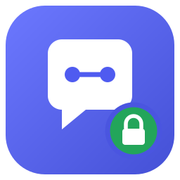
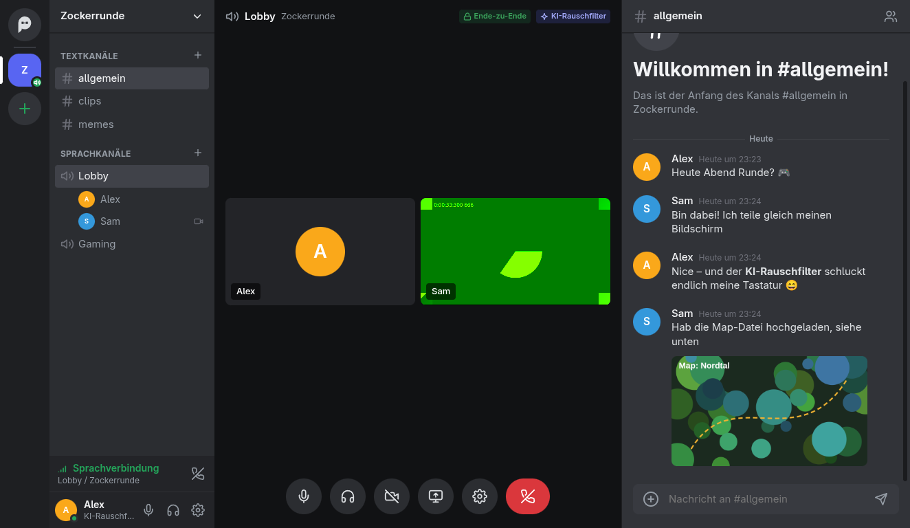
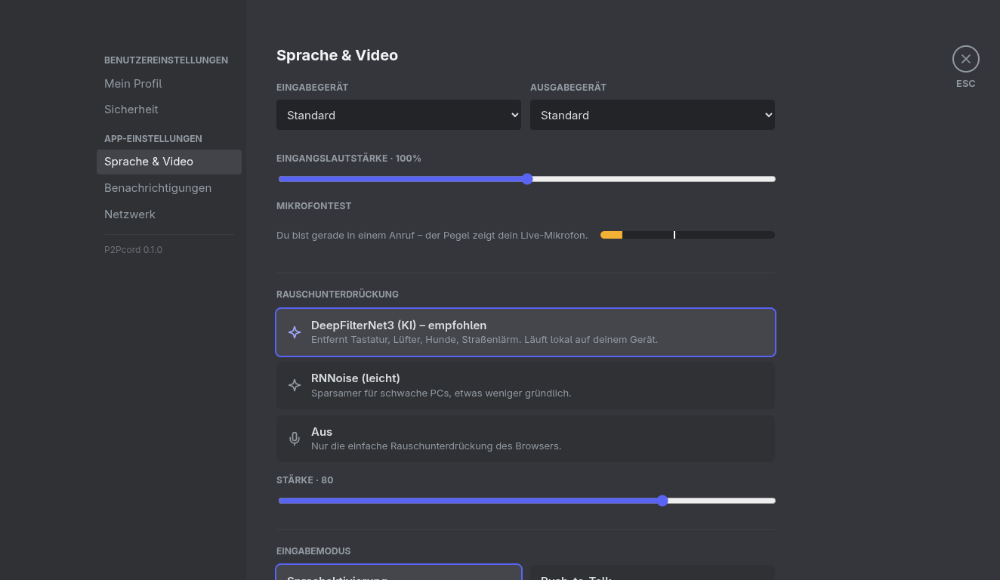

<p align="center">
  
</p>

<h1 align="center">P2Pcord</h1>

<p align="center">
  <b>Serverless voice, video and text chat for friends.</b><br>
  Looks like Discord, as simple as TeamSpeak – but peer-to-peer, end-to-end encrypted and without any account.
</p>

<p align="center">
  <a href="https://github.com/LouBoi161/p2pcord/releases/latest">Download</a> ·
  <a href="#installation">Installation</a> ·
  <a href="#security">Security</a> ·
  <a href="#building-from-source">Build from source</a> ·
  <a href="README.de.md">Deutsch</a>
</p>

<p align="center"><sub>🤖 Built with the help of AI – developed together with <a href="https://www.anthropic.com/claude">Claude</a> (Anthropic). Every commit made with AI assistance is marked <code>Co-Authored-By: Claude</code>.</sub></p>



## Why

TeamSpeak is buggy, Discord reads everything, and both need servers. P2Pcord connects you and your
friends directly. There is no server that can go down, get hacked or read along.

## Features

- **Groups** with text and voice channels, roles (owner / admin / member) and an invite system
- **Friends & direct messages**, including 1:1 calls with ringing, accept and decline
- **Invite codes** via blind pairing: one person and 24 hours by default, replaced codes are revoked
- **Messages** with replies, edits, deletes and a small markdown subset (`**bold**`, `*italic*`,
  `` `code` ``, code blocks, `||spoilers||`); links open only after confirmation
- **Files, images and videos** up to 2 GB: paste, drag & drop, previews, seekable video
- **Voice**: WebRTC mesh with Opus at 64/96/128 kbps, in-band FEC, no DTX, voice activity or
  push-to-talk, per-user volume, mute/deafen and speaking indicators
- **AI noise suppression**, running locally: DeepFilterNet3 (default) or RNNoise (light)
- **Camera** (720p) and **screen sharing** (up to 1080p60 / 1440p30)
- **Key rotation**: removing someone moves the group to fresh keys automatically, so they are really out
- **Safety numbers** to verify contacts, desktop notifications and sounds

<p align="center"></p>

## Installation

Download the file for your system from the
[latest release](https://github.com/LouBoi161/p2pcord/releases/latest).

| System | File | Status |
|---|---|---|
| Linux (any distro) | `P2Pcord-<version>-x64.AppImage` | ✅ tested |
| Arch Linux / Manjaro / CachyOS | AUR package `p2pcord-bin` | ✅ tested |
| Linux (manual) | `P2Pcord-linux-x64-<version>.zip` | ✅ tested |
| Windows 10/11 (x64) | `P2Pcord-win32-x64-<version>.zip` | ⚠️ experimental, unsigned |
| macOS (Apple Silicon) | `P2Pcord-darwin-arm64-<version>.zip` | ⚠️ experimental, unsigned |

### Linux – AppImage

```sh
chmod +x P2Pcord-*-x64.AppImage
./P2Pcord-*-x64.AppImage
```

To get it into your app menu, either use a tool such as
[Gear Lever](https://flathub.org/apps/it.mijorus.gearlever) or AppImageLauncher, or do it by hand:

```sh
mkdir -p ~/Applications ~/.local/share/applications
mv P2Pcord-*-x64.AppImage ~/Applications/P2Pcord.AppImage
cat > ~/.local/share/applications/p2pcord.desktop <<EOF
[Desktop Entry]
Type=Application
Name=P2Pcord
Exec=$HOME/Applications/P2Pcord.AppImage %U
Icon=p2pcord
Categories=Network;Chat;InstantMessaging;
StartupWMClass=P2Pcord
EOF
# icon (from the repository)
mkdir -p ~/.local/share/icons/hicolor/256x256/apps
curl -L -o ~/.local/share/icons/hicolor/256x256/apps/p2pcord.png \
  https://raw.githubusercontent.com/LouBoi161/p2pcord/main/build/icon/icon-256x256.png
```

If the AppImage does not start, install FUSE 2 (`libfuse2` on Debian/Ubuntu, `fuse2` on Arch,
`fuse-libs` on Fedora) or run it with `--appimage-extract-and-run`.

### Arch Linux (AUR)

```sh
yay -S p2pcord-bin      # or: paru -S p2pcord-bin
```

It installs to `/opt/p2pcord`, adds a menu entry and the `p2pcord` command.

### Windows

1. Unpack `P2Pcord-win32-x64-<version>.zip`, for example to `C:\Users\<you>\P2Pcord`.
2. Start `P2Pcord.exe`. The build is not code-signed, so SmartScreen will warn:
   click **More info → Run anyway**.
3. Optional: right-click `P2Pcord.exe` → *Send to → Desktop (create shortcut)*.
4. Allow network access when the Windows firewall asks (needed for direct connections).

### macOS

1. Unpack the zip and move `P2Pcord.app` to *Applications*.
2. The build is only ad-hoc signed, so remove the download quarantine once:
   ```sh
   xattr -dr com.apple.quarantine /Applications/P2Pcord.app
   ```
3. Start it; allow microphone, camera and screen recording when asked.

### First start

1. Pick a display name. A key pair is created on your device – that is your identity. No account, no password.
2. **Add a friend:** *Direct messages → Add friend → Create friend code* and send the code to your friend.
   Your friend enters it under *Redeem code*. You must be online while they redeem it.
3. **Create a group:** the **+** in the left bar. Invite people via the group menu → *Invite people*.
4. **Talk:** click a voice channel. Pick your microphone and noise suppression under ⚙ → *Voice & Video*.

## Security

| What | How |
|---|---|
| Identity | Ed25519 key pair per device, no account |
| Connections | Hyperswarm / Noise XX, bound to the peer's identity key |
| Messages & files | Each group is an encrypted Autobase; attachments live in a Hypercore encrypted with a key derived from the group key |
| Calls | WebRTC DTLS-SRTP directly between peers; SDP and fingerprints travel over the authenticated P2P channel, so there is no signaling server and no man in the middle |
| Joining | Blind pairing: an invite code contains no keys; an online member checks expiry, uses and the joiner's signature |
| Removing members | The group moves to a new base with fresh keys; every remaining member gets an invite sealed to their identity key (`crypto_box_seal`), restricted to the member list |
| Local data | Identity, group list and group keys are sealed with a vault key stored in the OS keychain (Electron `safeStorage`); opened attachments are wiped on exit |
| App | Electron sandbox, context isolation, strict CSP, no navigation or pop-ups, attachments are never rendered as documents |

**Known limits** – please read them:

- Peers you are connected to can see your **IP address** (true for every P2P app).
- Messages are **signed**: whoever has a copy can prove which identity key wrote it. They are not deniable.
- A removed member keeps what they received **before** removal.
- Offline delivery needs at least one group member to be online.
- For calls, WebRTC asks a public **STUN** server for your public address (address lookup only, no content);
  you can change it or add your own TURN server under ⚙ → *Network*.
- The code has **not been audited** by a third party.

## Noise suppression

Measured inside the app (offline rendering, clean speech plus noise from the DeepFilterNet repository):

| Filter | Pink noise, 10 dB SNR | Real-world noise, 5 dB SNR | CPU (Ryzen 7 7800X3D) |
|---|---|---|---|
| DeepFilterNet3 | −25 dB in speech pauses | −9 dB | ~7 % of one core |
| RNNoise | −22 dB | – | ~1 % |

The DeepFilterNet3 model and WebAssembly runtime are downloaded once at build time
(`scripts/fetch-models.mjs`) and pinned by SHA-256. Nothing is loaded from the network at runtime.

## Architecture

```
Renderer (Svelte, sandboxed)  ──IPC──  Electron main (thin shell)  ──pipe──  Bare worker (P2P)
  UI, WebRTC, audio pipeline           app:// + p2pfile:// protocols        Corestore, Hyperswarm,
                                        screen capture, keychain             Autobase, blind pairing
```

| Part | File | Role |
|---|---|---|
| Group logic | `workers/space.js` | Encrypted Autobase per group or DM; `apply()` enforces membership and roles deterministically on every peer |
| Backend | `workers/app.js` | Identity, groups, key rotation, files, RPC |
| Presence | `workers/presence.js` | Protomux channel: online state, voice state, WebRTC signaling |
| Vault | `workers/vault.js` | At-rest encryption of local secrets |
| Schema | `schema.js` → `spec/` | HyperSchema / HyperDB / HyperDispatch (generated) |
| Calls | `renderer/src/lib/voice/` | Mesh peer connections (perfect negotiation), mic chain, Opus tuning |
| UI | `renderer/src/components/` | Rail · channel list · call · chat · dialogs · settings |

## Building from source

Requirements: **Node.js ≥ 22** and **npm** (not pnpm), git. On Linux also FUSE 2 for AppImages.

```sh
git clone https://github.com/LouBoi161/p2pcord.git
cd p2pcord
npm install --ignore-scripts        # npm ≥ 12: add --allow-git=all (Electron Forge pulls a git dependency)
node node_modules/electron/install.js
npm start                           # builds the UI and starts the app
```

| Command | Result |
|---|---|
| `npm start` | Development run (data in `~/.config/P2Pcord-dev`) |
| `npm run start:peer -- /tmp/peer2` | A second instance with its own identity, for testing |
| `npm test` | Backend tests against a local DHT testnet |
| `npm run make` | Linux: AppImage + zip in `out/make/` |
| `npm run make:win` | Windows zip (also works as a cross-build from Linux) |
| `npx electron-forge make --targets @electron-forge/maker-zip` | macOS zip (run on a Mac) |

Testing without speakers or a real microphone: `P2PCORD_FAKE_MEDIA=1 npm run start:peer -- /tmp/a`.

Every push is tested in CI; tagged releases are built on GitHub Actions for Linux, Windows and macOS.

## Roadmap

- Peer-to-peer auto updates (pear-runtime OTA with multisig)
- Global push-to-talk while a game has focus
- Optional always-on peer (e.g. a Raspberry Pi) for offline delivery
- Reactions, typing indicator, mobile apps

## Made with AI

P2Pcord was developed with the help of AI: large parts of the code, tests and documentation were written
together with [Claude](https://www.anthropic.com/claude) (Anthropic) and reviewed, tested and directed by the
maintainer. Commits made with AI assistance carry a `Co-Authored-By: Claude` trailer.

The app itself uses AI only for **local noise suppression** (DeepFilterNet3 / RNNoise). It removes background
noise from your real voice, never generates or alters speech content, runs entirely on your device and can
be switched off in the settings.

## License

[Apache-2.0](LICENSE). Third-party components are listed in [NOTICE](NOTICE).

The source is mirrored on [GitLab](https://gitlab.com/louiswalder6/p2pcord).
